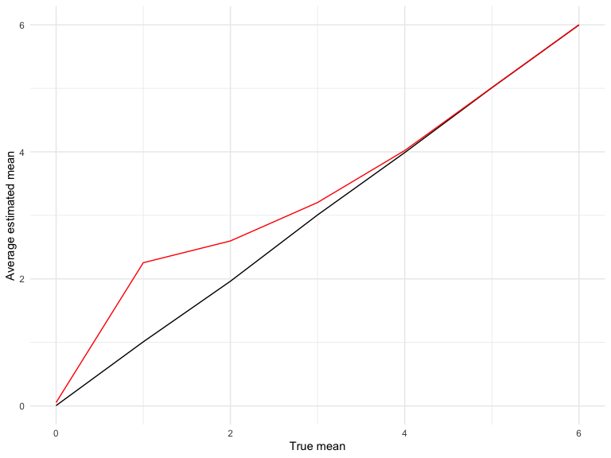

p8105_hw5_zz2780
================
Lydia Zhang
2022-11-15

# Problem 1

Import the data

``` r
full_df = 
  tibble(
    files = list.files("data/zip_data/"),
    path = str_c("data/zip_data/", files)
  ) %>% 
  mutate(data = map(path, read_csv)) %>% 
  unnest()
```

    ## Rows: 1 Columns: 8
    ## ── Column specification ────────────────────────────────────────────────────────
    ## Delimiter: ","
    ## dbl (8): week_1, week_2, week_3, week_4, week_5, week_6, week_7, week_8
    ## 
    ## ℹ Use `spec()` to retrieve the full column specification for this data.
    ## ℹ Specify the column types or set `show_col_types = FALSE` to quiet this message.
    ## Rows: 1 Columns: 8
    ## ── Column specification ────────────────────────────────────────────────────────
    ## Delimiter: ","
    ## dbl (8): week_1, week_2, week_3, week_4, week_5, week_6, week_7, week_8
    ## 
    ## ℹ Use `spec()` to retrieve the full column specification for this data.
    ## ℹ Specify the column types or set `show_col_types = FALSE` to quiet this message.
    ## Rows: 1 Columns: 8
    ## ── Column specification ────────────────────────────────────────────────────────
    ## Delimiter: ","
    ## dbl (8): week_1, week_2, week_3, week_4, week_5, week_6, week_7, week_8
    ## 
    ## ℹ Use `spec()` to retrieve the full column specification for this data.
    ## ℹ Specify the column types or set `show_col_types = FALSE` to quiet this message.
    ## Rows: 1 Columns: 8
    ## ── Column specification ────────────────────────────────────────────────────────
    ## Delimiter: ","
    ## dbl (8): week_1, week_2, week_3, week_4, week_5, week_6, week_7, week_8
    ## 
    ## ℹ Use `spec()` to retrieve the full column specification for this data.
    ## ℹ Specify the column types or set `show_col_types = FALSE` to quiet this message.
    ## Rows: 1 Columns: 8
    ## ── Column specification ────────────────────────────────────────────────────────
    ## Delimiter: ","
    ## dbl (8): week_1, week_2, week_3, week_4, week_5, week_6, week_7, week_8
    ## 
    ## ℹ Use `spec()` to retrieve the full column specification for this data.
    ## ℹ Specify the column types or set `show_col_types = FALSE` to quiet this message.
    ## Rows: 1 Columns: 8
    ## ── Column specification ────────────────────────────────────────────────────────
    ## Delimiter: ","
    ## dbl (8): week_1, week_2, week_3, week_4, week_5, week_6, week_7, week_8
    ## 
    ## ℹ Use `spec()` to retrieve the full column specification for this data.
    ## ℹ Specify the column types or set `show_col_types = FALSE` to quiet this message.
    ## Rows: 1 Columns: 8
    ## ── Column specification ────────────────────────────────────────────────────────
    ## Delimiter: ","
    ## dbl (8): week_1, week_2, week_3, week_4, week_5, week_6, week_7, week_8
    ## 
    ## ℹ Use `spec()` to retrieve the full column specification for this data.
    ## ℹ Specify the column types or set `show_col_types = FALSE` to quiet this message.
    ## Rows: 1 Columns: 8
    ## ── Column specification ────────────────────────────────────────────────────────
    ## Delimiter: ","
    ## dbl (8): week_1, week_2, week_3, week_4, week_5, week_6, week_7, week_8
    ## 
    ## ℹ Use `spec()` to retrieve the full column specification for this data.
    ## ℹ Specify the column types or set `show_col_types = FALSE` to quiet this message.
    ## Rows: 1 Columns: 8
    ## ── Column specification ────────────────────────────────────────────────────────
    ## Delimiter: ","
    ## dbl (8): week_1, week_2, week_3, week_4, week_5, week_6, week_7, week_8
    ## 
    ## ℹ Use `spec()` to retrieve the full column specification for this data.
    ## ℹ Specify the column types or set `show_col_types = FALSE` to quiet this message.
    ## Rows: 1 Columns: 8
    ## ── Column specification ────────────────────────────────────────────────────────
    ## Delimiter: ","
    ## dbl (8): week_1, week_2, week_3, week_4, week_5, week_6, week_7, week_8
    ## 
    ## ℹ Use `spec()` to retrieve the full column specification for this data.
    ## ℹ Specify the column types or set `show_col_types = FALSE` to quiet this message.
    ## Rows: 1 Columns: 8
    ## ── Column specification ────────────────────────────────────────────────────────
    ## Delimiter: ","
    ## dbl (8): week_1, week_2, week_3, week_4, week_5, week_6, week_7, week_8
    ## 
    ## ℹ Use `spec()` to retrieve the full column specification for this data.
    ## ℹ Specify the column types or set `show_col_types = FALSE` to quiet this message.
    ## Rows: 1 Columns: 8
    ## ── Column specification ────────────────────────────────────────────────────────
    ## Delimiter: ","
    ## dbl (8): week_1, week_2, week_3, week_4, week_5, week_6, week_7, week_8
    ## 
    ## ℹ Use `spec()` to retrieve the full column specification for this data.
    ## ℹ Specify the column types or set `show_col_types = FALSE` to quiet this message.
    ## Rows: 1 Columns: 8
    ## ── Column specification ────────────────────────────────────────────────────────
    ## Delimiter: ","
    ## dbl (8): week_1, week_2, week_3, week_4, week_5, week_6, week_7, week_8
    ## 
    ## ℹ Use `spec()` to retrieve the full column specification for this data.
    ## ℹ Specify the column types or set `show_col_types = FALSE` to quiet this message.
    ## Rows: 1 Columns: 8
    ## ── Column specification ────────────────────────────────────────────────────────
    ## Delimiter: ","
    ## dbl (8): week_1, week_2, week_3, week_4, week_5, week_6, week_7, week_8
    ## 
    ## ℹ Use `spec()` to retrieve the full column specification for this data.
    ## ℹ Specify the column types or set `show_col_types = FALSE` to quiet this message.
    ## Rows: 1 Columns: 8
    ## ── Column specification ────────────────────────────────────────────────────────
    ## Delimiter: ","
    ## dbl (8): week_1, week_2, week_3, week_4, week_5, week_6, week_7, week_8
    ## 
    ## ℹ Use `spec()` to retrieve the full column specification for this data.
    ## ℹ Specify the column types or set `show_col_types = FALSE` to quiet this message.
    ## Rows: 1 Columns: 8
    ## ── Column specification ────────────────────────────────────────────────────────
    ## Delimiter: ","
    ## dbl (8): week_1, week_2, week_3, week_4, week_5, week_6, week_7, week_8
    ## 
    ## ℹ Use `spec()` to retrieve the full column specification for this data.
    ## ℹ Specify the column types or set `show_col_types = FALSE` to quiet this message.
    ## Rows: 1 Columns: 8
    ## ── Column specification ────────────────────────────────────────────────────────
    ## Delimiter: ","
    ## dbl (8): week_1, week_2, week_3, week_4, week_5, week_6, week_7, week_8
    ## 
    ## ℹ Use `spec()` to retrieve the full column specification for this data.
    ## ℹ Specify the column types or set `show_col_types = FALSE` to quiet this message.
    ## Rows: 1 Columns: 8
    ## ── Column specification ────────────────────────────────────────────────────────
    ## Delimiter: ","
    ## dbl (8): week_1, week_2, week_3, week_4, week_5, week_6, week_7, week_8
    ## 
    ## ℹ Use `spec()` to retrieve the full column specification for this data.
    ## ℹ Specify the column types or set `show_col_types = FALSE` to quiet this message.
    ## Rows: 1 Columns: 8
    ## ── Column specification ────────────────────────────────────────────────────────
    ## Delimiter: ","
    ## dbl (8): week_1, week_2, week_3, week_4, week_5, week_6, week_7, week_8
    ## 
    ## ℹ Use `spec()` to retrieve the full column specification for this data.
    ## ℹ Specify the column types or set `show_col_types = FALSE` to quiet this message.
    ## Rows: 1 Columns: 8
    ## ── Column specification ────────────────────────────────────────────────────────
    ## Delimiter: ","
    ## dbl (8): week_1, week_2, week_3, week_4, week_5, week_6, week_7, week_8
    ## 
    ## ℹ Use `spec()` to retrieve the full column specification for this data.
    ## ℹ Specify the column types or set `show_col_types = FALSE` to quiet this message.

Tidy the data

``` r
tidy_df = 
  full_df %>% 
  mutate(
    files = str_replace(files, ".csv", ""),
    group = str_sub(files, 1, 3)) %>% 
  pivot_longer(
    week_1:week_8,
    names_to = "week",
    values_to = "outcome",
    names_prefix = "week_") %>% 
  mutate(week = as.numeric(week)) %>% 
  select(group, subj = files, week, outcome)
```

Graph

“This plot suggests high within-subject correlation – subjects who start
above average end up above average, and those that start below average
end up below average. Subjects in the control group generally don’t
change over time, but those in the experiment group increase their
outcome in a roughly linear way.”

``` r
tidy_df %>% 
  ggplot(aes(x = week, y = outcome, group = subj, color = group)) + 
  geom_point() + 
  geom_path() + 
  facet_grid(~group)
```


# Problem 2

Load the data from Github Repo

``` r
data2<-read.csv("https://raw.githubusercontent.com/washingtonpost/data-homicides/master/homicide-data.csv")
```

The raw data contains each homicide’s case number, reported date,
victims’ name, race, age, gender, the city and state of homicide, its
specific longitude and latitude, and the disposition.

The code below created variables city_state, grouped by cities and
summarized the number of total or unsolved homicides within each city.

``` r
data2_summary<-data2%>%
  mutate(
    city_state=paste(city, state, sep=", "))%>%
  group_by(city_state)%>%
 summarize(total=n(),
           unsolved=sum(disposition!="Closed by arrest"))

data2_summary
```

    ## # A tibble: 51 × 3
    ##    city_state      total unsolved
    ##    <chr>           <int>    <int>
    ##  1 Albuquerque, NM   378      146
    ##  2 Atlanta, GA       973      373
    ##  3 Baltimore, MD    2827     1825
    ##  4 Baton Rouge, LA   424      196
    ##  5 Birmingham, AL    800      347
    ##  6 Boston, MA        614      310
    ##  7 Buffalo, NY       521      319
    ##  8 Charlotte, NC     687      206
    ##  9 Chicago, IL      5535     4073
    ## 10 Cincinnati, OH    694      309
    ## # … with 41 more rows

I subset the data summary to only city of Baltimore, ran the
proportional test, and stored the prop test result as dataframe
bal.test.

``` r
baltimore<-data2_summary%>%
  subset(city_state=="Baltimore, MD")
bal.test<-broom::tidy(prop.test(baltimore$unsolved, baltimore$total))
```

I ran prop.test on every city, stored the test results in new variable
test, and extract estimates and 95%CI from the test variable. Finally I
deleted test variable for tidy purpose.

``` r
data2_prop_test<-data2_summary%>%
  mutate(
    test=purrr::map2(unsolved, total, prop.test),
    estimate=map_dbl(test,~.x[["estimate"]]),
    ci_lower=map_dbl(test,~.x[["conf.int"]][1]),
    ci_upper=map_dbl(test,~.x[["conf.int"]][2])
    )%>%
  select(-test)

data2_prop_test
```

    ## # A tibble: 51 × 6
    ##    city_state      total unsolved estimate ci_lower ci_upper
    ##    <chr>           <int>    <int>    <dbl>    <dbl>    <dbl>
    ##  1 Albuquerque, NM   378      146    0.386    0.337    0.438
    ##  2 Atlanta, GA       973      373    0.383    0.353    0.415
    ##  3 Baltimore, MD    2827     1825    0.646    0.628    0.663
    ##  4 Baton Rouge, LA   424      196    0.462    0.414    0.511
    ##  5 Birmingham, AL    800      347    0.434    0.399    0.469
    ##  6 Boston, MA        614      310    0.505    0.465    0.545
    ##  7 Buffalo, NY       521      319    0.612    0.569    0.654
    ##  8 Charlotte, NC     687      206    0.300    0.266    0.336
    ##  9 Chicago, IL      5535     4073    0.736    0.724    0.747
    ## 10 Cincinnati, OH    694      309    0.445    0.408    0.483
    ## # … with 41 more rows

The bar plot below shows, in descending order, the proportion of
unsolved homicides in each city as well as each 95% CI.

``` r
ggplot(data2_prop_test, aes(x =reorder(city_state, desc(estimate)), y = estimate)) +
  geom_bar(stat="identity")+
  geom_errorbar(width=.1, aes(ymin=ci_lower,ymax=ci_upper),position=position_dodge(width=0.5))+
  theme(axis.text.x = element_text(angle = 90, vjust = 0.5, hjust=1))+
  labs(x="City, State", y = "Proportion of Unsolved Homicide",title="Proportion of Unsolved Homicide in Each City")
```


# Problem 3

I used for loop to produce 5000 datasets with fixed n, mean, and sd.

``` r
output0=vector("list", 5000)

for(i in 1:5000){
  output0[[i]]=rnorm(n=30, mean=0, sd=5)
}
```

I created a list called test to record th t.test results of each
dataset, combined the list of test as dataframe test_results, and only
selected estimate and p-value.

``` r
test0=vector("list", 5000)

for(i in 1:5000){
  test0[[i]]=broom::tidy(t.test(output0[[i]]))
}

test_results_0=bind_rows(test0)%>%
  select(estimate, p.value)%>%
  mutate(
    true_mean=0
  )
test_results_0
```

    ## # A tibble: 5,000 × 3
    ##    estimate p.value true_mean
    ##       <dbl>   <dbl>     <dbl>
    ##  1  1.11     0.211          0
    ##  2  1.01     0.376          0
    ##  3  0.432    0.601          0
    ##  4 -0.215    0.823          0
    ##  5  1.76     0.0557         0
    ##  6  0.822    0.335          0
    ##  7 -0.314    0.690          0
    ##  8 -2.48     0.0135         0
    ##  9 -0.00453  0.997          0
    ## 10 -0.758    0.483          0
    ## # … with 4,990 more rows

I wrote a for loop outside the simulation of 5000 datasets for each true
mean (1 to 6), and the final dataframe containing the estimates,
p-value, and the true mean of each dataset.

``` r
test_results_total=data.frame()
for (a in 1:6){
  output=vector("list", 5000)
  test=vector("list", 5000)
for(i in 1:5000){
  output[[i]]=rnorm(n=30, mean=a, sd=5)
}
for(i in 1:5000){
  test[[i]]=broom::tidy(t.test(output[[i]]))
}
test_results=bind_rows(test)%>%
  select(estimate, p.value)%>%
  mutate(
    true_mean=a
  )
test_results_total=rbind(test_results_total,test_results)
}

test_results_total
```

    ## # A tibble: 30,000 × 3
    ##    estimate p.value true_mean
    ##       <dbl>   <dbl>     <int>
    ##  1   1.29   0.0937          1
    ##  2   1.96   0.0190          1
    ##  3   0.0827 0.945           1
    ##  4   1.64   0.112           1
    ##  5   3.08   0.00162         1
    ##  6   0.540  0.601           1
    ##  7   0.638  0.544           1
    ##  8   1.33   0.0606          1
    ##  9   1.33   0.0851          1
    ## 10   2.47   0.00407         1
    ## # … with 29,990 more rows

I combined the test results for mean=0 with mean of 1 to 6, created a
new variable rejected to distinguish those the null was rejected
(p-value\<0.05) from those the null was not rejected (p-value\>=0.05). I
grouped the dataset by true mean and rejected, calculated the frequency
of each proportion. Because we only want to see the proportion of times
the null was rejected, I filtered out rejected==No, and produced a line
graph to show the association between the proportion of times the null
was rejected and the true value of mu.

I observed that the larger the effect size, the higher the power is.

``` r
test_results_0_to_6<-rbind(test_results_0, test_results_total)
test_results_0_to_6%>%
  mutate(
    rejected=case_when(p.value<0.05 ~ "Yes",
                       TRUE~"No")
  )%>%
  group_by(true_mean, rejected)%>%
  summarize(n=n())%>%
  mutate(freq=n/sum(n))%>%
  filter(rejected=="Yes")%>%
  ggplot(aes(x=true_mean, y=freq))+
  geom_line()+
  labs(x="True Mean", y="Power")
```

    ## `summarise()` has grouped output by 'true_mean'. You can override using the
    ## `.groups` argument.


I first created a sub-dataset with only those the null is rejected, and
calculated their estimated mean grouping by true mean. Then I modified
the original dataset, calculated the total average of estimated mean for
each group of true mean, produced a line plot, then added the rejected
sample estimate mean as the red line in the graph.

I can observe that the sample average of estimated mean across tests for
which the null is rejected are NOT approximately equal to the true value
of mean when the true mean has a value of 1, 2, and 3. And their values
converge as the true mean value grows larger.

``` r
test_results_0_to_6_rejected<-test_results_0_to_6%>%
  mutate(
    rejected=case_when(p.value<0.05 ~ "Yes",
                       TRUE~"No")
  )%>%
  filter(rejected=="Yes")%>%
  group_by(true_mean)%>%
  summarize(avg_total=mean(estimate))
  
test_results_0_to_6%>%
  group_by(true_mean)%>%
  summarize(avg_total=mean(estimate))%>%
  ggplot(aes(x=true_mean, y=avg_total))+
  geom_line()+
  geom_line(data=test_results_0_to_6_rejected, color="red")+
  labs(x="True mean", y="Average estimated mean")
```


